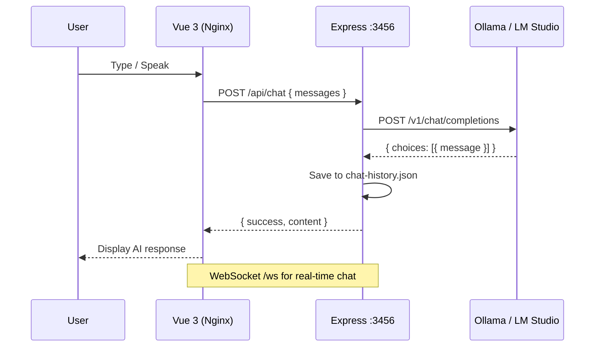

# 🧑‍🏫 ainstructor

> AI Language Instructor — learn Cantonese & Mandarin with real-time AI conversation and pronunciation feedback.

[](LICENSE)
[](https://vuejs.org)
[](https://expressjs.com)
[](https://docs.docker.com)

---

## 📁 Structure

```
ainstructor/
├── frontend/                # Vue 3 SPA (Vite + PWA)
│   ├── src/
│   │   ├── components/      # ChatInterface, LanguageSelector,
│   │   │                    #   PronunciationPanel, ProgressPanel, ScenarioMode
│   │   ├── composables/     # useChatMessages, useSpeechRecognition
│   │   ├── App.vue
│   │   └── main.js
│   ├── index.html
│   ├── vite.config.js
│   ├── package.json
│   └── docker/
│       ├── Dockerfile        # Multi-stage (node build → nginx serve)
│       └── nginx.conf
├── backend/                 # Express API + WebSocket
│   ├── src/
│   │   └── server.js         # Chat, pronunciation, scenarios
│   ├── data/                 # Runtime chat history (JSON)
│   ├── package.json
│   └── docker/
│       └── Dockerfile
├── docker-compose.yml       # One-command deploy
├── .env
└── README.md
```

---

## 🏗️ Architecture

### Data Flow



### Data Model

```mermaid
erDiagram
    CHAT {
        string id UUID
        string language "cantonese or mandarin"
        array messages "[{role, content}]"
        string response
        int timestamp Unix
    }
```

---

## ✨ Features

| Feature | Description |
|---------|-------------|
| 🤖 **AI Chat** | Practice conversation in Cantonese or Mandarin |
| 🎤 **Pronunciation** | Speech input → AI scores your pronunciation |
| 🎭 **Scenarios** | Restaurant, taxi, shopping, hospital roleplay |
| 📊 **Progress** | Track chat count and last active time |
| 🔌 **WebSocket** | Real-time chat streaming |
| 📱 **PWA** | Install on mobile/desktop, works offline |
| 🎛️ **Model Fallback** | Ollama → LM Studio auto-failover |

---

## 🚀 Quick Start

### Prerequisites

- Node.js ≥ 20
- [Ollama](https://ollama.com) running locally (or LM Studio on Mac)

### Development

```bash
# Terminal 1 — Backend
cd backend
npm install
npm run dev        # → http://localhost:3456

# Terminal 2 — Frontend
cd frontend
npm install
npm run dev        # → http://localhost:3001
```

### Docker

```bash
docker-compose up -d
```

| Service | URL |
|----------|-----|
| Frontend | http://localhost:3001 |
| Backend  | http://localhost:3456 |
| WebSocket | ws://localhost:3456/ws |

---

## 🔧 Environment

| Variable | Default | Description |
|----------|---------|-------------|
| `PORT` | `3456` | Backend port |
| `OLLAMA_URL` | `http://host.docker.internal:11434` | Ollama API |
| `LLM_STUDIO_URL` | `http://192.168.1.100:1234` | LM Studio (Mac Mini) |

---

## 📡 API Reference

### Chat

```http
POST /api/chat
Content-Type: application/json

{
  "messages": [{ "role": "user", "content": "你好" }],
  "language": "cantonese",
  "model": "opencode-go/kimi-k2.6"
}
```

### Pronunciation Check

```http
POST /api/pronunciation
Content-Type: application/json

{
  "spoken": "我讀呢句",
  "target": "我讀呢句",
  "language": "cantonese"
}
```

### Scenarios

```http
GET  /api/scenarios?language=cantonese
POST /api/scenario-start
```

### All Endpoints

| Method | Path | Description |
|--------|------|-------------|
| `GET` | `/api/health` | Health check |
| `POST` | `/api/chat` | AI conversation |
| `POST` | `/api/pronunciation` | Score pronunciation |
| `GET` | `/api/scenarios` | List scenario types |
| `POST` | `/api/scenario-start` | Begin a scenario |
| `GET` | `/api/progress` | User stats |

---

## 🛠️ Tech Stack

| Layer | Technology |
|-------|-----------|
| **Frontend** | Vue 3, Vite, Vite PWA |
| **Backend** | Express.js, ws (WebSocket) |
| **AI** | Ollama (kimi-k2.6), LM Studio |
| **Container** | Docker, Nginx |

---

## 🚢 Production Deployment

### Prerequisites
- Traefik reverse proxy running with `proxy-network`
- Docker + docker compose

```bash
# Deploy behind Traefik at /ainstructor
make docker-up

# Access: https://homelab.fire3san.duckdns.org/ainstructor
```

### Makefile Quick Reference

```bash
make help          # All commands
make install       # Install deps
make dev           # Dev servers
make test          # Run tests
make docker-up     # Deploy
make docker-logs   # View logs
make clean         # Clean artifacts
```

---


